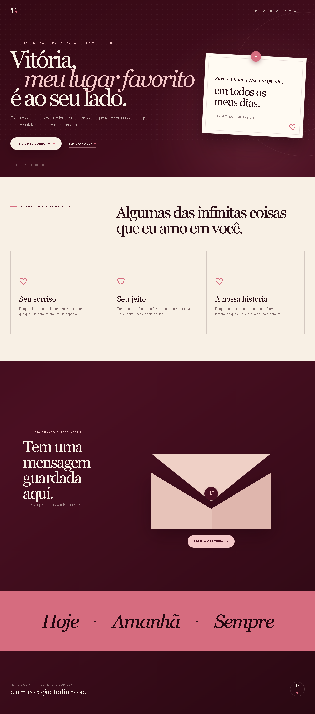
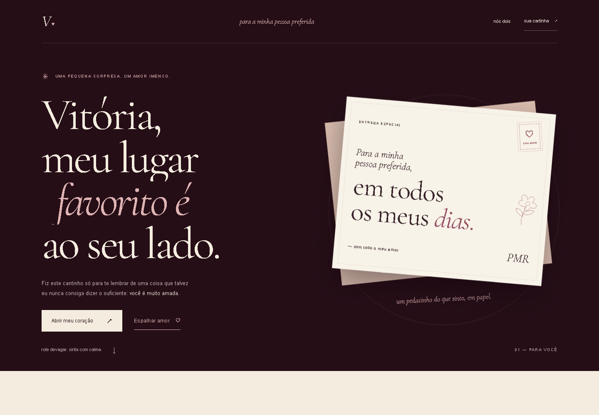

# Para Vitória, sempre você. ♥

Uma correspondência digital de PMR para Vitória: abertura cinematográfica, bilhetes, seis motivos interativos, uma surpresa e a carta original em um envelope. HTML, CSS e JavaScript puros; sem build, framework, backend ou dependências em produção.

## Revisar localmente

Com Node.js 22 ou superior, na pasta do repositório:

```sh
npm run dev
```

Abra [a experiência](http://127.0.0.1:4175/Vick-10_08/) ou [a cartinha diretamente](http://127.0.0.1:4175/Vick-10_08/#cartinha). O servidor não precisa de `npm install`; usa módulos nativos. Para trocar a porta no PowerShell: `$env:PORT=4176`.

Também é possível abrir `site/index.html` diretamente, ou usar `python -m http.server 8000 --directory site`. O servidor Node permite verificar exatamente o prefixo do GitHub Pages. A abertura aparece uma vez por sessão; **ver abertura ↺**, no início, e **reviver tudo ↺**, no encerramento, a reiniciam. Um endereço com âncora entra diretamente no capítulo.

Se o sistema solicitar movimento reduzido, a entrada é imediata por padrão. Nesse caso, a abertura oferece **ver com animações**: uma escolha explícita, reversível e lembrada somente durante a sessão. Para revisar a cortina, atualize a página, clique em **ver abertura** e depois em **entrar**.

## Organização e personalização

| Arquivo              | Responsabilidade                                                                        |
| -------------------- | --------------------------------------------------------------------------------------- |
| `site/index.html`    | Conteúdo afetivo, seis motivos, bilhetes, carta original e alternativas sem JavaScript. |
| `site/styles.css`    | Tokens em `:root`, tipografia, papéis, envelope, animações e responsividade.            |
| `site/script.js`     | Entrada/sessão, carta, foco, coração, carrossel, segredos e áudio opcional.             |
| `site/assets/fonts/` | Cormorant Garamond local, subconjunto latino, licença OFL e origem.                     |
| `scripts/serve.cjs`  | Servidor local com `/Vick-10_08/` e raiz apontando para `site/`.                        |
| `tests/`             | Regressões de interação, layout, acessibilidade e resiliência.                          |
| `docs/REVISAO.md`    | Auditoria inicial, três rodadas visuais, resultados e limites.                          |

As antigas cópias de HTML/CSS/JS da raiz foram removidas. **`site/` é a fonte única publicada**, como já definido no workflow. A frase do hero, os três motivos originais e a carta pessoal foram preservados. Os três motivos adicionais não inventam acontecimentos, datas ou características biográficas.

### Fotografias

Não foram encontradas fotos reais. A mesa de lembranças usa trechos afetivos e bilhetes completos; não há fotos fictícias ou espaços vazios. Para personalizar depois, adicione fotos autorizadas em `site/assets/photos/` e substitua um dos bilhetes de `#memorias` por um `figure.memory-photo`. O CSS dessa composição já está preparado.

```html
<figure class="memory-photo">
  
  <figcaption>Uma legenda confirmada por vocês.</figcaption>
</figure>
```

Use dimensões reais, WebP/AVIF comprimido e `srcset` quando houver versões menores. `object-fit: contain` preserva a imagem inteira, inclusive rostos. Ajuste proporção e enquadramento olhando 360, 390, 768 e 1440 px. Não deduza datas do nome do repositório. Se uma foto passar a ser a imagem principal do hero, retire `loading="lazy"` dela.

### Música

Nenhuma faixa foi fornecida ou encontrada. O player fica totalmente oculto. Para adicionar uma música autorizada, coloque o arquivo em `site/assets/audio/` e configure o elemento existente:

```html
<audio
  id="music"
  src="assets/audio/nossa-musica.mp3"
  preload="none"
  loop
></audio>
```

Isso habilita um controle explícito de tocar/pausar após a entrada. O site inicia sem som; `play()` ocorre no clique e o volume sobe até 18% em cerca de dois segundos. Pausar e reviver não reiniciam o áudio automaticamente. Há estado de erro e tentativa manual. A mídia de teste não faz parte da pasta publicada. Valide reprodução no dispositivo real depois de escolher a faixa.

### Carta e interações

Edite a carta em `.personal-letter`; ela existe uma única vez no HTML. Sem JS, `details#letter-fallback` permite lê-la. Com JS, o mesmo artigo entra em um `dialog` nativo, com Escape, fechamento visível, contenção/devolução do foco e restauração da rolagem. O coração pode ser segurado por 1,5 s, ativado com Enter/Espaço ou recebido pelo botão alternativo.

Os motivos usam `details` nativos, carrossel com controles no modo usual e uma lista sem animação com movimento reduzido. O link V♥ continua voltando ao início e revela um bilhete após cinco ativações. Todos os caminhos de mídia são relativos.

## Verificações

```sh
npm ci
npx playwright install chromium webkit
npm run dev
# Em outro terminal:
npm run check
npm test
npm run test:entrance
npm run test:layout
npm run test:resilience
```

`VICK_URL` permite testar outro servidor. Os relatórios JSON e screenshots vão para `test-results/`, ignorado pelo Git. Não existe etapa de build para publicar.

Resultado desta revisão: **16/16 fluxos de interação, 11/11 cenários de resiliência e nove configurações de layout** passaram. Axe não detectou violações nos estados auditados. Lighthouse mobile: **98 Performance / 100 Acessibilidade**, tanto na entrada quanto no hero. Condições e limites estão na [revisão](docs/REVISAO.md), incluindo zoom por reflow emulado e mídia simulada no WebKit para Windows.

Na correção posterior da entrada, **8/8 testes específicos em Chromium/WebKit** e novamente os **16/16 fluxos de interação** passaram. A cortina agora revela as linhas do hero enquanto sobe; seu término segue a animação, com saída de segurança caso ela falhe. Axe também não detectou violações na abertura com a escolha de movimento visível. As pontuações Lighthouse acima são da revisão anterior a essa correção.

## Antes e depois

| Antes                                                        | Depois                                                    |
| ------------------------------------------------------------ | --------------------------------------------------------- |
|  |  |
|   |   |

A revisão visual passou por composição, estados interativos e acabamento. Foram corrigidos overflow decorativo, legenda encoberta, envelope prematuramente aberto, contraste durante a interação, devolução de foco no WebKit, posição da surpresa e sobreposição do player opcional sobre o replay.

## Publicação

O workflow existente `.github/workflows/pages.yml` publica **somente `site/`** ao receber push em `main` ou `workflow_dispatch`. Ele foi inspecionado e preservado. Não existem gates anteriores de CI.

Esta entrega foi preparada em `redesign/vitoria-editorial`, sem push, merge, acionamento de workflow ou publicação. Antes de publicar, revisar a versão local e obter a autorização final do proprietário. Documentação, evidências, testes e dependências de desenvolvimento ficam fora do artefato publicado.
